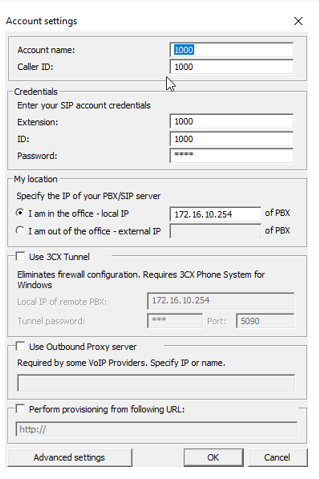
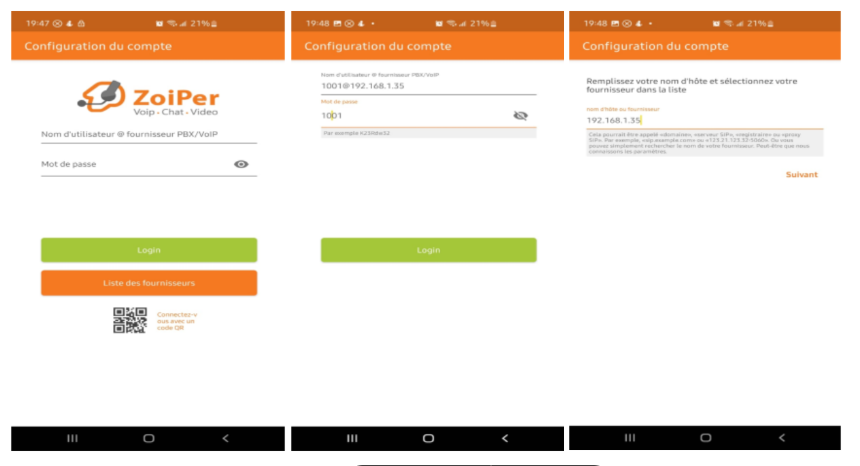
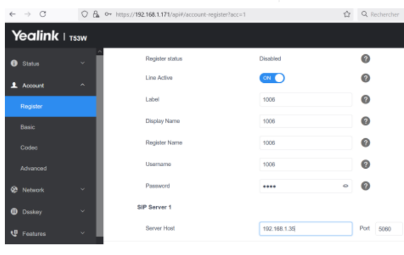

# VoIP avec Asterisk - Cas pratique

## Informations

| Champ           | Détails                                |
|-----------------|---------------------------------       |
| **Auteur**      | William Mbakop                         |
| **Date**        | 13 janvier 2025                         |
| **Description** | VoIP avec Asterisk - Cas pratique      |

### Pré-requis

#### Les machines virtuelles :
- VM serveur Linux : 
    - VM serveur Linux 
    - VM cliente Linux et/ou Windows

#### Configuration des VM linux sur VMWare WorkStation Pro 17 :

- [Ubuntu 22.04.05](https://releases.ubuntu.com/jammy/ubuntu-22.04.5-desktop-amd64.iso)
- Ram 4 Go
- Décocher Accélération 3D graphics


#### Configuration de la VM Windows sur VMWare WorkStation Pro 17 :

- Windows 10
- Ram 4 Go
- Décocher Accélération 3D graphics


### Installation d'Asterisk sur la <ins>VM serveur<ins>

#### Installation des prérequis pour Asterisk


Obtenir les privilèges root

```bash
sudo su
```

Mise à jour la liste des paquets disponibles et installation les dernières versions des paquets installés sur le système

```bash
apt update && apt upgrade -y
```

Création du répertoire /usr/src/asterisk

```bash
mkdir -p /usr/src/asterisk
```

Attribution des permissions maximales (lecture, écriture, exécution) à tous les utilisateurs pour ce répertoire et son contenu

```bash
chmod 777 -R /usr/src/asterisk
```

Déplacement vers le répertoire courant vers /usr/src/asterisk.

```bash
cd /usr/src/asterisk
```

Téléchargement de l'archive de la version 13.38.3 d'Asterisk depuis le site officiel

```bash
wget https://downloads.asterisk.org/pub/telephony/asterisk/releases/asterisk-13.38.3.tar.gz
```

Décompression du fichier tar.gz téléchargé dans le répertoire actuel

```bash
tar -xvzf asterisk-13.38.3.tar.gz
```

Déplacement vers le répertoire courant vers le dossier contrib/scripts de l'installation décompressée

```bash
cd asterisk-13.38.3/contrib/scripts
```

Exécution du script pour installer les prérequis nécessaires à l'installation d'Asterisk

```bash
./install_prereq install
```

Attention : Mettre 33 en indicatif du pays


Revenir deux niveaux en arrière dans l'arborescence des répertoires.

```bash
cd ../..
```

Création d'un fichier vide nommé dependances.sh dans le répertoire courant.

```bash
touch dependances.sh
```

Attribution des permissions maximales (lecture, écriture, exécution) à tous les utilisateurs pour le fichier dependances.sh.

```bash
chmod 777 dependances.sh
```

Ouvrir le fichier dependances.sh dans l'éditeur de texte nano pour l'éditer.

```bash
nano dependances.sh
```

coller ces commandes :

```bash
apt-get install linux-headers-4.9.0-6 -y 
apt-get install build-essential -y 
apt-get install libxml2-dev -y 
apt-get install libncurses5-dev -y 
apt-get install libreadline-dev -y 
apt-get install libreadline6-dev -y 
apt-get install libssl-dev -y 
apt-get install uuid-dev -y 
apt-get install libjansson-dev -y 
apt-get install libsqlite3-dev -y 
apt-get install pkg-config -y 
apt-get install perl -y 
apt-get install libwww-perl -y
apt-get install sox -y 
apt-get install mpg123 -y 
apt-get install libedit-dev -y 
apt-get install libedit2 -y
```

Exécution du script dependances.sh pour installer ou configurer les dépendances nécessaires.

```bash
./dependances.sh
```

Lancement du script de configuration pour préparer l'installation d'Asterisk, en vérifiant les prérequis et générant les fichiers de configuration nécessaires. 

```bash
./configure
```

ATTENTION : Mettre le terminal en grand écran

Ouvrir l'outil de sélection des modules d'Asterisk, permettant de choisir les modules ou options à inclure ou exclure dans la compilation.

```bash
make menuselect
```

- Dans l’onglet Channel Drivers : s’assurer que le package « chan_sip » est bien coché 
- Dans Core Sound Packages: cocher x2 CORE-SOUNDS-FR-ULAW
- Dans Music On Hold File Packages: cocher x2 MOH-OPSOUND-ULAW x2
- Dans Extras Sound Packages: cocher x2 EXTRA-SOUNDS-FR-ULAW

Compilation des fichiers source d'Asterisk en exécutables, selon les options définies précédemment.

```bash
make
```

Installation des fichiers compilés sur le système, rendant Asterisk opérationnel.

```bash
make install
```

Configuration d'Asterisk pour qu'il puisse être démarré automatiquement en tant que service système.

```bash
make config
```

Installation des fichiers de configuration d'exemple dans le répertoire /etc/asterisk pour servir de base à la configuration.

```bash
make samples
```

Changement de répertoire courant vers /etc/asterisk, où se trouvent les fichiers de configuration d'Asterisk.

```bash
cd /etc/asterisk
```

Ouverture du fichier de configuration des modules (modules.conf) dans l'éditeur de texte nano pour le modifier.

```bash
nano modules.conf
```

On ajoute ces deux lignes à la fin du fichier : 

```bash
load => chan_sip
load => chan_sip.so
```

#### Configuration d’un utilisateur et un groupe dédiés pour exécuter Asterisk et ajustement des permissions des fichiers nécessaires

Création d'un groupe système nommé "asterisk"

```bash
groupadd asterisk
```

Création d'un utilisateur système "asterisk" avec un répertoire principal défini à /var/lib/asterisk et association au groupe "asterisk".
```bash
useradd -r -d /var/lib/asterisk -g asterisk asterisk
```

Ajout d'utilisateur "asterisk" aux groupes "audio" et "dialout" pour lui donner accès aux périphériques audio et aux ports série.

```bash
usermod -aG audio,dialout asterisk
```

Changement de propriétaire de tous les fichiers et répertoires dans /etc/asterisk pour l'utilisateur "asterisk".

```bash
chown -R asterisk /etc/asterisk
```

Changement de propriétaire des fichiers dans les répertoires /var/lib, /var/log, et /var/spool/asterisk pour l'utilisateur "asterisk".

```bash
chown -R asterisk /var/{lib,log,spool}/asterisk
```

Changement de propriétaire des fichiers dans /usr/lib/asterisk pour l'utilisateur "asterisk".

```bash
chown -R asterisk /usr/lib/asterisk
```
Attribution des permissions maximales (lecture, écriture, exécution) aux répertoires listés pour tous les utilisateurs.

```bash
chmod -R 777 /var/{lib,log,run,spool}/asterisk /usr/lib/asterisk /etc/asterisk
```

### Configuration d’Asterisk


Ouverture du fichier /etc/default/asterisk avec l'éditeur nano pour personnaliser la configuration par défaut d'Asterisk.

```bash
nano /etc/default/asterisk
```

On décommente les lignes suivantes :

```bash
AST_USER= « asterisk » 
AST_GROUP= « asterisk »
```

Ouverture du fichier de configuration principal d'Asterisk pour modifier les paramètres de l'utilisateur et du groupe exécutant le service

```bash
nano /etc/asterisk/asterisk.conf
```

On décommente les lignes suivantes :

```bash
runuser = asterisk
rungroup = asterisk
```

Redémarrage du service Asterisk et affiche son statut pour vérifier qu'il fonctionne correctement

```bash
systemctl restart asterisk && systemctl status asterisk
```

Sauvegarde du fichier de configuration sip.conf en sip.conf.sauv pour préserver l'original avant modification

```bash
mv sip.conf sip.conf.sauv
```

Sauvegarde du fichier de configuration extensions.conf en extensions.conf.sauv pour préserver l'original avant modification

```bash
mv extensions.conf extensions.conf.sauv
```

Sauvegarde du fichier de configuration voicemail.conf en voicemail.conf.sauv pour préserver l'original avant modification

```bash
mv voicemail.conf voicemail.conf.sauv
```

Ouverture d'un nouveau fichier sip.conf pour définir les comptes SIP et leurs paramètres

```bash
nano sip.conf
```

Ajouter ces lignes :

```bash
[general]
context=default
bindport=5060
bindaddr=0.0.0.0
language=fr
disallow=all
allow=ulaw
allow=alaw
#register => B_A:azerty@192.168.8.134

[1000]
secret=1000
type=friend
host=dynamic
callerid="John" <1000>
mailbox=1000@default

[1001]
secret=1001
type=friend
host=dynamic
callerid="Mike" <1001>
mailbox=1001@default

[1002]
secret=1002
type=friend
host=dynamic
callerid="Peter" <1002>
mailbox=1002@default

[1003]
secret=1003
type=friend
host=dynamic
callerid="BRAD" <1003>
mailbox=1003@default

[1004]
secret=1004
type=friend
host=dynamic
callerid="Jason" <1004>
mailbox=1004@default
#[A_B]
#type=friend
#secret=azerty
#context=default
#host=dynamic
#insecure=port,invite
```
Ouverture du fichier de configuration 'extensions.conf'. Ce fichier contient les définitions des extensions, des contextes, et des règles de traitement des appels.

```bash
nano /etc/asterisk/extensions.conf
```

Ajouter les lignes suivantes :

```bash
[default]
exten => 1000,1,Answer()
exten => 1000,n,Dial(Sip/1000,10)
exten => 1000,n,VoiceMail(1000)
exten => 1000,n,Hangup()

exten => 1001,1,Answer()
exten => 1001,n,Dial(Sip/1001,10)
exten => 1001,n,VoiceMail(1001)
exten => 1001,n,Hangup()

exten => 1002,1,Answer()
exten => 1002,n,Dial(Sip/1002,10)
exten => 1002,n,VoiceMail(1002)
exten => 1002,n,Hangup()

exten => 1003,1,Answer()
exten => 1003,n,Dial(Sip/1003,10)
exten => 1003,n,VoiceMail(1003)
exten => 1003,n,Hangup()

exten => 1004,1,Answer()
exten => 1004,n,Dial(Sip/1004,10)
exten => 1004,n,VoiceMail(1004)
exten => 1004,n,Hangup()
#exten => _2XXX,1,Dial(Sip/A_B/${EXTEN})
exten => 500,1,VoiceMailMain()
```

Ouverture du fichier de configuration de la messagerie vocale Asterisk. Ce fichier définit les paramètres de la messagerie vocale, tels que les boîtes vocales, les notifications, et les options de configuration des messages

```bash
nano /etc/asterisk/voicemail.conf
```

Ajouter les lignes suivantes (Attention : Ne pas oublier de modifier les adresses IP)  :

```bash
[default]
1000 => 1000,John,1000@172.16.10.254
1001 => 1001,Mike,1001@172.16.10.254
1002 => 1002,Peter,1002@172.16.10.254
1003 => 1003,Brad,1003@172.16.10.254
1004 => 1004,Jason,1004@172.16.10.254
```

Redémarrage du service Asterisk et affichage de son statut pour vérifier qu'il fonctionne correctement

```bash
systemctl restart asterisk && systemctl status asterisk
```

Lancement d'Asterisk en mode console avec un niveau de verbosité élevé (4 "v") pour un débogage détaillé.  Si cette commande échoue, utilisation de 'asterisk -cvvvv' pour forcer le démarrage avec une vérification de configuration

```bash
asterisk -rvvvv
```
Si ça ne fonctionne pas : taper ```asterisk -cvvvv ```

Rechargement de la configuration du module SIP d'Asterisk pour appliquer les changements sans redémarrer le service

```bash
sip reload
```

Affichage de la liste des utilisateurs SIP actuellement configurés dans Asterisk

```bash
sip show users
```

### Paramétrage d'une Softphone 3cxsur la <ins>VM cliente<ins> Linux (ex. club22)

- Télécharger application [3CX Softphone](https://www.3cx.fr/voip-telephone/softphone/)
- Cliquer Auto provision puis sur Cancel
- Cliquer sur Set account
- Un menu apparait à renseigner de la manière suivante :
- Cliquer sur new
- Renseigner les champs comme sur l'image ci-dessous ( Ne pas oublier à modifier l'adresse ip en mettant l'adresse ip de la <ins>VM serveur<ins>) :



- Après validation : on devrait voir **On Hook** s'afficher sur le téléphone virtuel


### Gestion de la musique d'attente

#### Configuration à effectuer sur la <ins>VM serveur<ins>

- Télécharger et transformer une musique en mp3 :

    - Aller sur YouTube choisissez votre musique, puis effacer le « ube » de youtube dans la barre d’adresse.
ex. https://yout.com/video/?url=https://www.youtube.com/watch?v=qXQT4bl1lNE 

    - Cliquer sur changement de format vers mp3 pour télécharger votre musique en mp3.

Déplacement vers le répertoire de configuration d'Asterisk

```bash
cd /etc/asterisk
```

Ouverture du fichier de configuration 'musiconhold.conf' dans l'éditeur nano. Ce fichier définit les paramètres de la musique d'attente (musiconhold) dans Asterisk.

```bash
nano musiconhold.conf
```

Effectuer les modifications suivantes :

- Changer la ligne « mode=files » par « mode=mp3 » 
- Changer la ligne « directory=moh » par « directory=/var/lib/asterisk/moh/music


Ouverture du fichier de configuration 'extensions.conf' dans l'éditeur nano. Ce fichier contient les définitions des extensions, des contextes et des règles de traitement des appels.

```bash
nano /etc/asterisk/extensions.conf
```

Ajouter à la fin du fichier :


```bash
exten => 6,1,Musiconhold(/var/lib/asterisk/moh/music)
```

Déplacement vers le répertoire de travail vers le dossier où Asterisk stocke les fichiers de musique d'attente.

```bash
cd /var/lib/asterisk/moh
```

Création d'un nouveau répertoire "music" pour y stocker des fichiers audio de musique d'attente

```bash
mkdir music
```

Déplacement vers le répertoire de travail vers le répertoire principal /var/lib/

```bash
cd /var/lib
```

Attribution des permissions 777 (lecture, écriture, exécution pour tous) de manière récursive à tout le répertoire /var/lib/asterisk pour assurer que tous les fichiers dans ce répertoire soient accessibles par Asterisk

```bash
chmod 777 -R /var/lib/asterisk
```

Déplacement vers le répertoire de travail vers le dossier 'Téléchargements' de l'utilisateur William

```bash
cd /home/William/Téléchargements 
```

Attribution des permissions 777 (lecture, écriture, exécution pour tous) au fichier de musique téléchargée

```bash
chmod 777 nomDeLaMusiqueTéléchargée
```

Déplacement du fichier de musique téléchargé vers le répertoire de musique d'attente d'Asterisk

```bash
mv nomDeLaMusiqueTéléchargée /var/lib/asterisk/moh/music
```


Redémarrage du service Asterisk et affichage de son statut pour vérifier qu'il fonctionne correctement

```bash
systemctl restart asterisk && systemctl status asterisk
```

Déplacement vers le répertoire de travail vers le répertoire de configuration d'Asterisk

```bash
cd /etc/asterisk
```

Lancement d'Asterisk en mode console avec un niveau de verbosité élevé (4 "v") pour un débogage détaillé.  Si cette commande échoue, utilise 'asterisk -cvvvv' pour forcer le démarrage avec une vérification de configuration

```bash
asterisk -rvvvv  # Si ça ne marche pas : taper asterisk -cvvvv
```
Rechargement de la configuration du module SIP d'Asterisk pour appliquer les modifications sans redémarrer le service

```bash
sip reload
```

#### Test à effectuer sur la <ins>VM cliente<ins> 

- S'appeler en composant 1000 
- Mettre l'appel en attente
- Profiter de la musique téléchargée

### Gestion de la redirection vocale

#### Configuration à effectuer sur la <ins>VM serveur<ins>

Déplacement vers le répertoire de travail vers le répertoire 'agi-bin' où sont stockés les scripts AGI d'Asterisk


```bash
cd /var/lib/asterisk/agi-bin
```

Téléchargement du script 'googletts.agi' depuis le dépôt GitHub pour l'intégration de Google Text-to-Speech dans Asterisk


```bash
wget https://raw.githubusercontent.com/zaf/asterisk-googletts/master/googletts.agi
```

Attribution des permissions 777 (lecture, écriture, exécution pour tous) au script 'googletts.agi' pour assurer son exécution

```bash
chmod 777 googletts.agi
```

Ouverture du fichier 'extensions.conf' dans l'éditeur nano pour ajouter ou configurer les extensions nécessaires pour utiliser le script AGI


```bash
nano /etc/asterisk/extensions.conf
```

On ajoute ce code à la fin du fichier :

```bash
#IVR Test
exten => 8000,1,Answer()
exten => 8000,2,agi(googletts.agi, « Test du service interactif vocal », fr)
exten => 8000,3,Hangup()
```
NB : La phrase « test du service interactif » peut être modifier à votre guise pour faire dire tout et n’importe quoi à notre service vocale

Redémarrage du service Asterisk et affichage de son statut pour vérifier qu'il fonctionne correctement

```bash
systemctl restart asterisk && systemctl status asterisk
```

Lancement d'Asterisk en mode console avec un niveau de verbosité élevé (4 "v") pour un débogage détaillé.  Si cette commande échoue, utilisation de 'asterisk -cvvvv' pour forcer le démarrage avec une vérification de configuration

```bash
asterisk -rvvvv  # Si ça ne marche pas : taper 'asterisk -cvvvv'
```

Rechargement de la configuration du module SIP d'Asterisk pour appliquer les changements sans redémarrer le service

```bash
sip reload
```

#### Test à effectuer sur la <ins>VM cliente<ins> 

Effectuer un test sur une <ins>VM cliente<ins> en composant 8000. 
On devrait écouter la phrase « Test du service interactif vocal »


### Configuration du service vocale ++

#### Configuration à effectuer sur la <ins>VM serveur<ins>

Le but est d'améliorer notre service vocal, en configurant la redirection vocale.

Ouverture du fichier de configuration 'extensions.conf' dans l'éditeur nano. Ce fichier contient la définition des extensions, des contextes et des règles de traitement des appels dans Asterisk

```bash
nano /etc/asterisk/extensions.conf
```

Ajouter ces lignes à la fin du fichier :

```bash
#extensions des IVR 

# Lorsque le numéro 400 est composé, le dialplan indique au serveur qu'il doit se rendre au contexte nommé « ivr » pour la suite de la communication. 
exten => 400,1,Goto(ivr,s,1)

[ivr]
# La première étape de l'appel est le fait que le serveur réponde.
exten => s,1,Answer()

# Mise en place d'un timeout de 10 secondes pour le que l'appelant fasse un choix parmi ceux proposés.
exten => s,n,Set(TIMEOUT(response)=20)

# Annonce des différents choix
# "agi" : est l'application utilisé
# "googletts.agi" est le script qui lira le texte, 
# "fr" est la langue, 
# "any" : l'appelant peut appuyer sur n'importe quelle touche pour arrêter
# La lecture du texte, "1.3" est la vitesse de lecture du texte, elle est par défaut à 1
exten => s,n,agi(googletts.agi,"Bienvenue à IMIE. Nous sommes ouverts du lundi au vendredi de 9h à 17h",fr,any,1.3)

# Wait permet de mettre un temps d'attente avant la lecture de la ligne suivante
exten => s,n,Wait(1)
exten => s,n,agi(googletts.agi,"Pour acceder au service informatique, tapez 1",fr,any,1.3)
exten => s,n,Wait(1)
exten => s,n,agi(googletts.agi,"Pour acceder au service administratif, tapez 2",fr,any,1.3)
exten => s,n,Wait(1)
exten => s,n,agi(googletts.agi,"Pour acceder au service de support, tapez 3",fr,any,1.3)
exten => s,n,Wait(1)
exten=> s,n,agi(googletts.agi,"Appuyez sur dièse, si vous souhaitez réécouter ce
message",fr,any,1.3)

# On attend que l'utilisateur appuie sur une touche pour faire son choix
exten => s,n,WaitExten()

# Si l'utilisateur appuie sur 1 on va à la priorité 1 du contexte informatique
exten => 1,1,Goto(informatique,s,1)

# Si l'utilisateur appuie sur 2 on va à la priorité 1 du contexte administratif
exten => 2,1,Goto(administratif,s,1)

# Si l'utilisateur appuie sur 3 on va à la priorité 1 du contexte support
exten => 3,1,Goto(support,s,1)

# Si l'utilisateur tape un numéro compris entre 3 et 9 et # il retourne à l'étape 3 de l'IVRexten => _[4-9#],1,Goto(ivr,s,3)

# Si l'utilisateur ne fait rien il retourne à l'étape 3 de l'IVR au bout de 10 secondes
exten => t,1,Goto(ivr,s,3)
[informatique]
exten => s,1,Dial(SIP/1000,5)
exten => s,n,Voicemail(1000)
exten => s,n,Hangup()

[administratif] 
exten => s,1,Dial(SIP/1001,5)
exten => s,n,Voicemail(1001)
exten => s,n,Hangup()

[support]
exten => s,1,Dial(SIP/1002,5)
exten => s,n,Voicemail(1002)
exten => s,n,Hangup()
```

#### Test à effectuer sur la <ins>VM cliente<ins>  :

- Composer 400


### Paramétrage de Zoiper pour l'utilisation sur téléphone portable et tablette

Téléchargez l’application : ZOIPER PRO (elle existe sur Samsung seulement)


Se connecter en renseignant l'utilisateur (utilisateur@adresseIPduServeur) et le mot de passe de l'utilisateur (cf. secret).

Par exemple, pour se connecter avec l'utilisateur 1001, l'identifiant est 1001@172.16.10.254 et le mot de passe est 1001



Passer à l'étape suivante. 

Le « SIP UDP » doit s’afficher en vert


Appuyer sur terminer pour terminer la configuration

Il est maintenant possible d'appeler les numeros configurés.


### Utilisation d'Asterisk avec un téléphone fixe

*Pour cet exemple, nous avons utilisé un téléphone de marque Yeahlink*


La VM serveur et le téléphone fixe doivent être sur le même réseau.

Si besoin, utiliser un switch pour les connecter physiquement sur le même réseau.


Allumer le téléphone :

Dans le cas où le téléphone a déjà été configuré, nous allons le réinitialiser.

Pour y parvenir, appuyer sur ```OK``` » pendant quelques secondes, puis sur l’écran 
```reset to factory setting```

Appuyer une deuxième fois sur ```ok```


Une fois le téléphone allumé aller dans ```menu``` puis ```statuts``` pour retrouver l’adresse IP de la machine

Saisir l'adresse IP sur le navigateur web de la VM serveur
L’utilisateur et le mot de passe sont : admin
cliquer sur ```account``` puis sur ```Register```
Mettre line active » sur ```ON```.

Mettre l'identidiant de l'utilisateur (ex. 1006) qui va utiliser le téléphone fixe ans les champs ```Label```, ```Display Name```, ```Register Name```, ```Username```
Mettre le mot de passe correspondant à l'identifiant de l'utilisateur
Dans Serveur Host, mettre l'adresse IP de la VM serveur.




Si tout a été fait correctement, le téléphone affichera l'identifiant de l'utilisateur.

Sur la VM serveur, relancer le service Asterisk

```bash
systemctl restart asterisk && systemctl status asterisk
```

puis saisissez la commande :

```bash
asterisk –rvvv
```

Si cette commande ne fonctionne pas tapez 

```bash
asterisk –cvvv
```
Recharger la configuration SIP

```bash
sip reload
```

Afficher les utilisateurs SIP

```bash
sip show users
```

Afficher les pairs SIP

```bash
sip show peers
```

Il est miantenant possible d'utiliser Asterisk sur ce téléphone fixe
